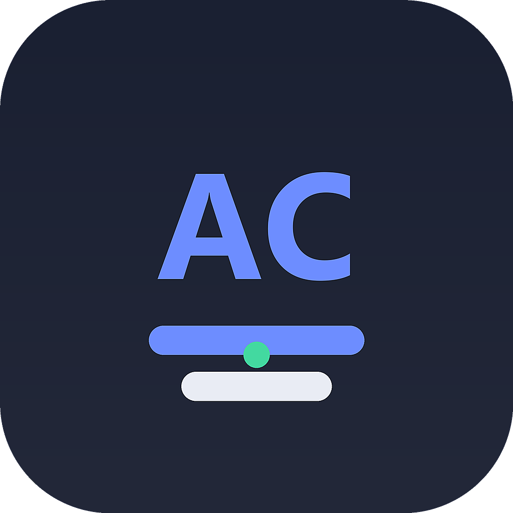
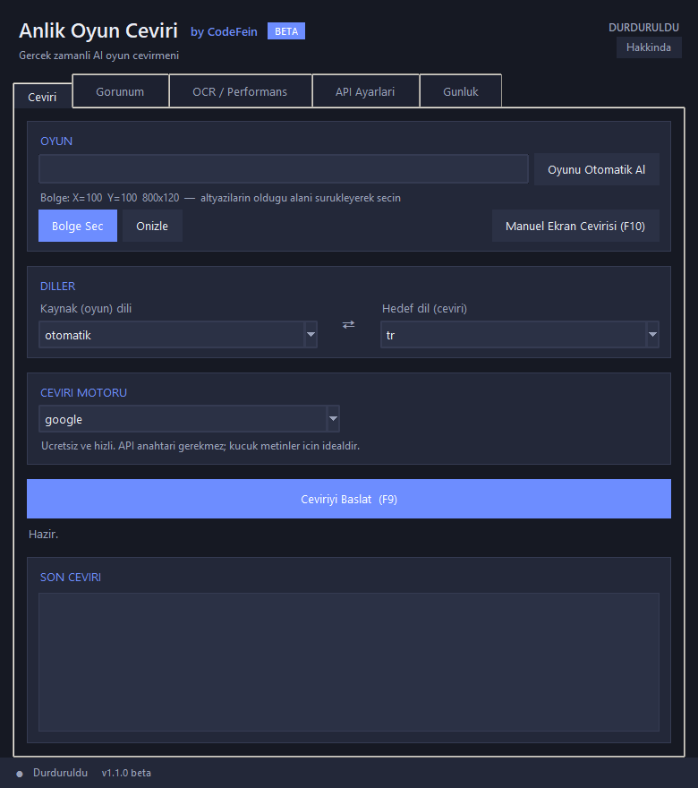
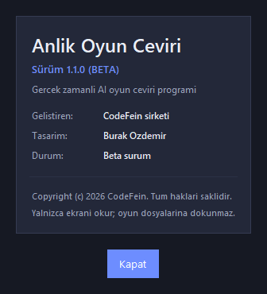

# Anlik Oyun Ceviri

<p align="center">
  
</p>

<p align="center">
  <strong>PC oyunlarinda altyazilari gercek zamanli okuyup (OCR) ceviren, oyunun
  uzerine saydam altyazi (overlay) olarak bindiren AI ceviri programi</strong>
  <br>
  <sub>Beta v1.1.0</sub>
</p>

<p align="center">
  
  
  
</p>

SimulTranslate gibi ticari araclardan farkli olarak tamamen yerel calisir:
oyun dosyalarina veya oyun bellegine dokunmaz, yalnizca ekran goruntusunu okur.
Bu nedenle anti-cheat sistemleri acisindan ekran kaydi almakla aynidir.

---

## Hakkinda

- **Gelistiren:** CodeFein sirketi
- **Tasarim:** Burak Ozdemir
- **Durum:** Beta (v1.1.0)
- **Telif:** Copyright (c) 2026 CodeFein. Tum haklari saklidir.

## Ekran Goruntuleri

<p align="center">
  
</p>

<p align="center">
  <em>Ana kontrol penceresi: 5 sekme (Ceviri, Gorunum, OCR/Performans, API Ayarlari, Gunluk)</em>
</p>

<p align="center">
  
</p>

<p align="center">
  <em>Hakkinda penceresi: kodfein ve tasarim bilgileri</em>
</p>

## Ozellikler

- **Gercek zamanli OCR:** Tesseract motoru (Japonca, Korece, Cince, Rusca, Turkce dahil 100+ dil), Windows OCR yedegi.
- **Ceviri motorlari:** Google (ucretsiz), MyMemory (ucretsiz yedek), DeepL API, ChatGPT/Gemini/DeepSeek API (OpenAI uyumlu).
- **Toplu ceviri:** Birden fazla altyazi satiri tek istekte cevrilir; gecikme dusuk tutulur.
- **Overlay:** Oyunun uzerinde saydam ya da kutu (`box`) modunda, tiklamasi oyuna gecen, her zaman ustte altyazi katmani. Yazinin fontu, boyutu, rengi ve saydamligi ayarlanabilir.
- **Onbellek:** Ayni metni tekrar cevirmez; oyun bazli cache ile gecikme dusuk tutulur.
- **Bolge secimi:** Altyazilarin oldugu bolgeyi fareyle surukleyerek secersiniz; bolgeyi onizleyebilirsiniz.
- **Oyun profilleri:** Her oyunun kendi bolge/dil/gorunum ayarlari otomatik kaydedilir; on plandaki pencere basligindan oyun adi otomatik algilanir.
- **Canli istatistik:** FPS, ceviri gecikmesi, cevrilen satir sayisi, cache isabeti ve boyutu anlik gosterilir.
- **Kisayollar:** F9 = ceviriyi baslat/durdur, F10 = ekrani aninda cevir, F11 = altyaziyi goster/gizle.
- **Gizlilik:** API anahtarlariniz cihazinizda kalir; ceviri gecmisi sunucuda saklanmaz.

## Kurulum

**Kurulum paketi (onerilen):** `dist/AnlikOyunCeviri-Kurulum-v1.1.0-beta.exe` dosyasini
indirin ve calistirin. Kurulum; uygulamayi `%LOCALAPPDATA%\Programs\AnlikOyunCeviri`
altina kurar, Baslat menusu ve masaustu kisa yolu olusturur. Tesseract OCR ve 9 dil
paketi paketin icinde gelir — ayrica bir sey kurmaniz gerekmez.

**Kaynak koddan (gelistiriciler icin):** Gereksinim Windows 10/11, Python 3.10+.

```
python kurulum.py
```

Bu betik bagimliliklari kurar ve Tesseract OCR'i denetler. Tesseract icin:

```
winget install UB-Mannheim.TesseractOCR
```

Kurulumdan sonra `tessdata` klasoru zaten projeyle gelir (eng, tur, deu, fra,
spa, rus, jpn, kor, chi_sim dil paketleri). Ek dil icin
`https://github.com/tesseract-ocr/tessdata_fast` adresinden
`<kod>.traineddata` dosyasini indirip `tessdata` klasorune atin.

## Kullanim

```
python app.py
```

1. **Bolge Sec** butonu ile oyun icinde altyazilarin gorundugu alani
   fareyle surukleyerek secin; **Onizle** ile overlay'in gorunumunu test edin.
2. Kaynak / hedef dil ve ceviri motorunu secin.
3. **Baslat (F9)** butonuna basin. Oyunu tam ekran acip oynarken ceviri
   altyazisi alan uzerinde belirecek.
4. F9 ile durdurun; ayarlar `config.json` dosyasina otomatik kaydedilir.
   Oyun adi girilirse veya on plandaki pencereden algilanirsa ayarlar o oyunun
   profili olarak saklanir.

Ipucu: `F9` kisayolu icin uygulama yonetici olarak calisiyorsa her yerde
calisir; degilse pencere uzerinden buton da kullanabilirsiniz.

## Ceviri motorlari

| Motor     | Anahtar | Aciklama                                        |
|-----------|---------|-------------------------------------------------|
| Google    | gerekmez| Ucretsiz, kucuk metinler icin hizli             |
| MyMemory  | gerekmez| Google kapaliyken otomatik yedek                |
| DeepL     | gerekir | Dogal ceviri kalitesi (yuksek)                  |
| OpenAI    | gerekir | ChatGPT / Gemini / DeepSeek (OpenAI uyumlu URL) |

DeepL anahtari: https://www.deepl.com/pro-api
OpenAI anahtari: https://platform.openai.com/api-keys
Gemini kullanmak icin Base URL'e `https://generativelanguage.googleapis.com/v1beta/openai/`
yazip `openai` anahtarina Gemini API anahtarini girin.

Kendi anahtariniz yoksa sadece Google/MyMemory ile sinirsiz ucretsiz ceviri
yapabilirsiniz.

## Mimari

```
app.py                     -> giris noktasi
kurulum.py                 -> bagimlilik kurulum betigi
LICENSE                    -> telif haklari bildirimi
assets/                    -> logo ve ekran goruntuleri
build/                     -> logo, spec, paketleme betigi
installer/                 -> Inno Setup kurulum betigi
dist/                      -> derlenen exe ve setup.exe ciktisi
config.json                -> kullanici ayarlari + oyun profilleri
tessdata/                  -> OCR dil paketleri
cache/                     -> oyun bazli ceviri onbellegi
anlik_oyun_ceviri/
  config.py                -> ayar yukle/kaydet, profil yardimcilari
  theme.py                 -> koyu tema, modern butonlar
  screen.py                -> ekran yakalama (mss), sanal masaustu
  ocr.py                   -> Tesseract + Windows OCR yedegi
  translator.py            -> Google/MyMemory/DeepL/OpenAI + toplu ceviri + cache
  pipeline.py              -> arka plan: yakala -> OCR -> cevir (thread)
  overlay.py               -> saydam/kutu modlu tiklamasiz overlay
  selector.py              -> bolge secme ekrani
  gui.py                   -> sekme tabanli ayar penceresi (5 sekme)
```

## Paketleme ve yayinlama (beta)

Hazir kurulum paketi proje klasorunun `dist/` dizininde uretilir:

- `dist/AnlikOyunCeviri/`        -> tasinabilir (portable) uygulama klasoru
- `dist/AnlikOyunCeviri-Kurulum-v1.1.0-beta.exe` -> kurulum (setup) exe'si

Kurulum paketi: uygulamayi `%LOCALAPPDATA%\Programs\AnlikOyunCeviri` altina
kurar, Baslat menusu ve (istenirse) masaustu kisa yolu olusturur, kaldirma
ozelligi sunar. Tesseract OCR ve 9 dil paketi paketin icinde gelir; ayrica
kurulum gerekmez.

Yeniden paketlemek icin:

```
python build\build_app.py      # PyInstaller ile uygulama exe'si
"C:\Program Files (x86)\Inno Setup 6\ISCC.exe" installer\installer.iss
```

Notlar:
- Logo: `python build\make_logo.py` ile `assets/logo.png` ve `assets/logo.ico` uretilir.
- Ekran goruntuleri: `python build\make_screenshots.py`
- Paket boyutu ~241 MB (Tesseract + DLL'ler dahil), setup.exe ~74 MB.
- Beta surum: v1.1.0. Ayarlar `_internal/config.json` ve `_internal/cache/`
  icinde saklanir; kaldiricida temizlenir.

## Sorun giderme

- **"OCR motoru hazir degil"**: Kurulum paketiyle gelen Tesseract otomatik bulunur.
  Kaynak koddan calisiyorsaniz Tesseract'i kurun (`winget install UB-Mannheim.TesseractOCR`).
  Varsa `config.json` icindeki `tesseract_cmd` alanina exe yolunu yazin.
- **Japonca/Korece okumuyor**: `tessdata` klasorune `jpn.traineddata` /
  `kor.traineddata` eklendiginden emin olun ve `ocr_langs` ayarini `eng+jpn`
  gibi guncelleyin.
- **Ceviri hatasi**: `config.json` icinde `engine` seceneklerinden birine gecin
  veya API anahtari kontrol edin. Internet baglantisi gerekir.

## Uyari ve Lisans

- Program yalnizca ekrani okur; oyun dosyalarini/memory'sini degistirmez.
  Yine de kullandiginiz oyun ve platformlarin kendi kurallarina uymak
  kullanicinin sorumlulugundadir.
- Tum haklari saklidir. Ayrintilar icin [LICENSE](LICENSE) dosyasina bakin.
