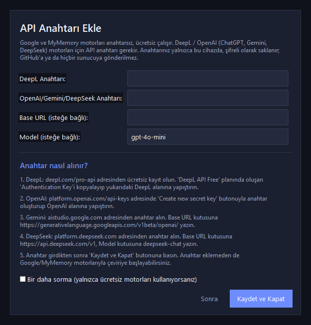

# Anlık Oyun Çeviri

<p align="center">
  
</p>

<p align="center">
  <strong>PC oyunlarında altyazıları gerçek zamanlı okuyup (OCR) çeviren, oyunun
  üzerine saydam altyazı (overlay) olarak bindiren AI çeviri programı</strong>
  <br>
  <sub>Beta v1.1.1 · Türkçe / English</sub>
</p>

<p align="center">
  
  
  
</p>

SimulTranslate gibi ticari araçlardan farklı olarak ekran görüntüsü tamamen
yerel işlenir: oyun dosyalarına veya oyun belleğine dokunmaz, yalnızca ekran
görüntüsünü okur. OCR ve overlay yereldir; çevrilecek **metin**, seçtiğiniz
motorun sunucusuna gönderilir (Google/MyMemory ücretsiz, DeepL/OpenAI
anahtarlı). Anti-cheat açısından ekran kaydı almakla aynıdır.

---

## Hakkında

- **Geliştiren:** CodeFein Studio
- **Tasarım:** Burak Özdemir
- **Durum:** Beta (v1.1.1)
- **Telif:** Copyright (c) 2026 CodeFein Studio. Tüm hakları saklıdır.

## Ekran Görüntüleri

<p align="center">
  
</p>

<p align="center">
  <em>Ana kontrol penceresi: 5 sekme (Çeviri, Görünüm, OCR/Performans, API Ayarları, Günlük)</em>
</p>

<p align="center">
  
</p>

<p align="center">
  <em>İlk açılışta beliren "API Anahtarı Ekle" penceresi: anahtar alanları ve adım adım alma talimatları</em>
</p>

<p align="center">
  
</p>

<p align="center">
  <em>Hakkında penceresi: CodeFein Studio ve tasarım bilgileri</em>
</p>

## Özellikler

- **Gerçek zamanlı OCR:** Tesseract motoru (Japonca, Korece, Çince, Rusça, Türkçe dahil 100+ dil), Windows OCR yedeği. PSM ayarı, büyütme, güven eşiği ve OCR timeout desteği.
- **Çeviri motorları:** Google (ücretsiz), MyMemory (ücretsiz yedek), DeepL API, ChatGPT/Gemini/DeepSeek API (OpenAI uyumlu).
- **Toplu çeviri:** Birden fazla altyazı satırı tek istekte çevrilir; satırlar işaretleyicilerle eşleştirilir, motor satır sayısını bozarsa otomatik satır satır yedeğe geçilir.
- **Akıllı yakalama:** Değişmeyen karelerde OCR atlanır (görüntü hash'i) — CPU ve OCR yükü ciddi oranda düşer.
- **Overlay:** Oyunun üzerinde saydam ya da kutu (`box`) modunda, tıklaması oyuna geçen, her zaman üstte altyazı katmanı. Overlay, ekran yakalamasından hariç tutulur (WDA_EXCLUDEFROMCAPTURE) — kendi çıktısını tekrar OCR'lamaz.
- **Önbellek:** Aynı metni tekrar çevirmez; oyun bazlı cache ile gecikme düşük tutulur. Cache anahtarı motor/model değişiminde geçersizleşir.
- **Bölge seçimi:** Altyazıların olduğu bölgeyi fareyle sürükleyerek seçersiniz; negatif koordinatlı çoklu monitör kurulumları desteklenir.
- **Oyun profilleri:** Her oyunun kendi bölge/dil/görünüm ayarları otomatik kaydedilir; oyun adı ön plandaki **process (.exe)** adından algılanır.
- **Canlı istatistik:** FPS, çeviri gecikmesi, çevrilen satır sayısı, cache isabeti, atlanan kare sayısı ve hatalar anlık gösterilir.
- **Güvenilir yaşam döngüsü:** Altyazı kaybolduğunda otomatik temizlenir, durdurma thread'i bekler, pipeline hatalarında durum arayüzde bildirilir.
- **İlk açılış rehberi:** API anahtarı tanımlı değilse program açılınca "API Anahtarı Ekle" penceresi belirir; DeepL / OpenAI / Gemini / DeepSeek için anahtar alanları ve adım adım alma talimatları sunulur. Anahtarsız da Google/MyMemory ile çalışır.
- **İki dilli arayüz:** Arayüz Türkçe ve İngilizce çalışır (API Ayarları → DİL / LANGUAGE veya `config.json` içinde `"language": "en"`).
- **Kısayollar:** F9 = çeviriyi başlat/durdur, F10 = ekranı anında çevir, F11 = altyazıyı göster/gizle.
- **Gizlilik:** API anahtarlarınız Windows DPAPI ile şifrelenmiş olarak saklanır; çeviri geçmişi sunucuda saklanmaz.

## Dil / Language

Arayüz dilini değiştirmek için **API Ayarları → DİL / LANGUAGE** bölümünden
**Türkçe** veya **English** seçin ve uygulamayı yeniden başlatın. Dil ayarı
`config.json` dosyasında `"language": "tr"` / `"language": "en"` olarak
saklanır.

To switch the UI language, open **API Settings → LANGUAGE**, choose
**Türkçe** or **English**, then restart the app. The setting is stored in
`config.json` as `"language": "tr"` / `"language": "en"`.

## Kullanıcı Verileri

Ayarlar (`config.json`), çeviri önbelleği (`cache/`) ve oyun profilleri
uygulama klasörü yerine **`%LOCALAPPDATA%\AnlikOyunCeviri`** altında tutulur.
Eski sürümden kalan `config.json` ilk açılışta otomatik taşınır. API anahtarları
DPAPI ile şifrelenerek yazılır; ayar dosyası bozulursa yedeklenir ve varsayılan
ayarlarla devam edilir.

## Kurulum

**Kurulum paketi (önerilen):** `dist/AnlikOyunCeviri-Kurulum-v1.1.1-beta.exe` dosyasını
indirin ve çalıştırın. Kurulum; uygulamayı `%LOCALAPPDATA%\Programs\AnlikOyunCeviri`
altına kurar, Başlat menüsü ve masaüstü kısayolu oluşturur. Tesseract OCR ve 9 dil
paketi paketin içinde gelir — ayrıca bir şey kurmanız gerekmez.

**Kaynak koddan (geliştiriciler için):** Gereksinim Windows 10/11, Python 3.10+.

```
python kurulum.py
```

Bu betik bağımlılıkları kurar ve Tesseract OCR'i denetler. Tesseract için:

```
winget install UB-Mannheim.TesseractOCR
```

Kurulumdan sonra `tessdata` klasörü zaten projeyle gelir (eng, tur, deu, fra,
spa, rus, jpn, kor, chi_sim dil paketleri). Ek dil için
`https://github.com/tesseract-ocr/tessdata_fast` adresinden
`<kod>.traineddata` dosyasını indirip `tessdata` klasörüne atın.

## Kullanım

```
python app.py
```

1. **Bölge Seç** butonu ile oyun içinde altyazıların göründüğü alanı
   fareyle sürükleyerek seçin; **Önizle** ile overlay'in görünümünü test edin.
2. Kaynak / hedef dil ve çeviri motorunu seçin.
3. **Başlat (F9)** butonuna basın. Oyunu tam ekran açıp oynarken çeviri
   altyazısı alan üzerinde belirecek.
4. F9 ile durdurun; ayarlar `%LOCALAPPDATA%\AnlikOyunCeviri\config.json`
   dosyasına otomatik kaydedilir. Oyun adı girilirse veya ön plandaki
   pencereden algılanırsa ayarlar o oyunun profili olarak saklanır.

İpucu: `F9` kısayolu için uygulama yönetici olarak çalışıyorsa her yerde
çalışır; değilse pencere üzerinden buton da kullanabilirsiniz.

## Çeviri Motorları

| Motor     | Anahtar | Açıklama                                        |
|-----------|---------|-------------------------------------------------|
| Google    | gerekmez| Ücretsiz, küçük metinler için hızlı             |
| MyMemory  | gerekmez| Google kapalıyken otomatik yedek                |
| DeepL     | gerekir | Doğal çeviri kalitesi (yüksek)                  |
| OpenAI    | gerekir | ChatGPT / Gemini / DeepSeek (OpenAI uyumlu URL) |

DeepL anahtarı: https://www.deepl.com/pro-api
OpenAI anahtarı: https://platform.openai.com/api-keys
Gemini kullanmak için Base URL'e `https://generativelanguage.googleapis.com/v1beta/openai/`
yazıp `openai` anahtarına Gemini API anahtarını girin.

Kendi anahtarınız yoksa sadece Google/MyMemory ile sınırsız ücretsiz çeviri
yapabilirsiniz.

## Mimari

```
app.py                     -> giriş noktası
kurulum.py                 -> bağımlılık kurulum betiği
LICENSE                    -> telif hakları bildirimi
assets/                    -> logo ve ekran görüntüleri
build/                     -> logo, spec, paketleme betiği
installer/                 -> Inno Setup kurulum betiği
dist/                      -> derlenen exe ve setup.exe çıktısı
tessdata/                  -> OCR dil paketleri
tests/                     -> pytest testleri
requirements-dev.txt       -> test bağımlılıkları
%LOCALAPPDATA%\AnlikOyunCeviri\ -> config.json + cache (kullanıcı verisi)
anlik_oyun_ceviri/
  config.py                -> ayar yükle/kaydet, DPAPI şifreleme, profil yardımcıları
  theme.py                 -> koyu tema, modern butonlar
  i18n.py                  -> çoklu dil desteği (Türkçe / English)
  screen.py                -> ekran yakalama (mss), CaptureSession, sanal masaüstü
  ocr.py                   -> Tesseract + Windows OCR yedeği, PSM/timeout
  translator.py            -> Google/MyMemory/DeepL/OpenAI + işaretleyicili toplu çeviri + cache
  pipeline.py              -> yaşam döngüsü: yakala -> OCR -> çevir (durum makinesi)
  overlay.py               -> saydam/kutu modlu, yakalamadan hariç tutulan overlay
  selector.py              -> bölge seçme ekranı (negatif koordinat destekli)
  gui.py                   -> sekmeli ayar penceresi (5 sekme, TR/EN)
```

## Testler

```
pip install -r requirements-dev.txt
python -m pytest tests -q
```

Pipeline yaşam döngüsü (boş OCR temizliği, tek karakter koruması, stop/restart,
hata durumu), önbellek ve işaretleyicili toplu çeviri, config/DPAPI, OCR dil ve
PSM ayarları ve ekran yakalama için 36 test.

## Paketleme ve Yayınlama (beta)

Hazır kurulum paketi proje klasörünün `dist/` dizininde üretilir:

- `dist/AnlikOyunCeviri/`        -> taşınabilir (portable) uygulama klasörü
- `dist/AnlikOyunCeviri-Kurulum-v1.1.1-beta.exe` -> kurulum (setup) exe'si

Kurulum paketi: uygulamayı `%LOCALAPPDATA%\Programs\AnlikOyunCeviri` altına
kurar, Başlat menüsü ve (istenirse) masaüstü kısayolu oluşturur, kaldırma
özelliği sunar. Tesseract OCR ve 9 dil paketi paketin içinde gelir; ayrıca
kurulum gerekmez.

Yeniden paketlemek için:

```
python build\build_app.py      # PyInstaller ile uygulama exe'si
"C:\Program Files (x86)\Inno Setup 6\ISCC.exe" installer\installer.iss
```

Notlar:
- Logo: `python build\make_logo.py` ile `assets/logo.png` ve `assets/logo.ico` üretilir.
- Ekran görüntüleri: `python build\make_screenshots.py`
- Paket boyutu ~241 MB (Tesseract + DLL'ler dahil), setup.exe ~74 MB.
- Beta sürüm: v1.1.1. Kullanıcı verisi `%LOCALAPPDATA%\AnlikOyunCeviri`
  altında tutulur; kaldırıcı önbelleği temizler, ayarlar kullanıcıya bırakılır.

## Sorun Giderme

- **"OCR motoru hazır değil"**: Kurulum paketiyle gelen Tesseract otomatik bulunur.
  Kaynak koddan çalışıyorsanız Tesseract'ı kurun (`winget install UB-Mannheim.TesseractOCR`).
  Varsa `%LOCALAPPDATA%\AnlikOyunCeviri\config.json` içindeki `tesseract_cmd` alanına exe yolunu yazın.
- **Japonca/Korece okumuyor**: `tessdata` klasörüne `jpn.traineddata` /
  `kor.traineddata` eklendiğinden emin olun ve `ocr_langs` ayarını `eng+jpn`
  gibi güncelleyin.
- **Çeviri hatası**: Ayarlarda `engine` seçeneklerinden birine geçin
  veya API anahtarı kontrol edin. İnternet bağlantısı gerekir.

## Uyarı ve Lisans

- Program yalnızca ekranı okur; oyun dosyalarını/memory'sini değiştirmez.
  Yine de kullandığınız oyun ve platformların kendi kurallarına uymak
  kullanıcının sorumluluğundadır.
- Tüm hakları saklıdır. Ayrıntılar için [LICENSE](LICENSE) dosyasına bakın.
